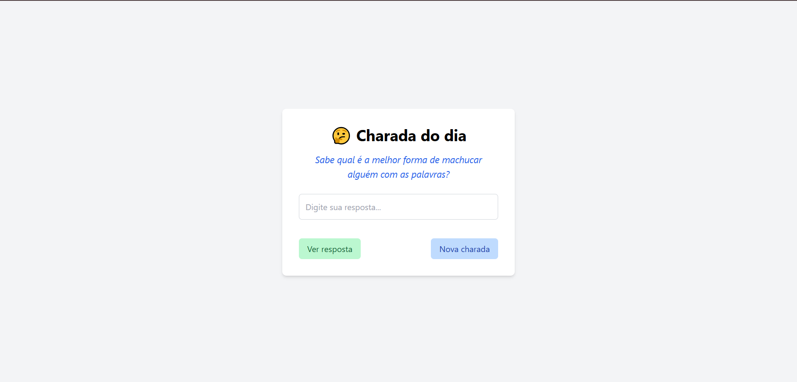

# 🤔 Charadas

Este é um projeto simples em JavaScript que consome uma API de charadas de forma aleatória e permite que o usuário tente adivinhar a resposta.

## Tela inicial


## 🚀 Funcionalidades

- Busca uma charada aleatória a partir da [API Charadas](https://api-charadas-seven.vercel.app);
- Exibe a pergunta ao usuário;
- Permite que o usuário digite uma resposta e verifique se está correta;
- Fornece feedback visual:
  - ✅ Resposta correta
  - 🟠 Resposta parcialmente correta
  - ❌ Resposta errada

## Tecnologias Utilizadas
 
 
 

## Autora
[<br><sub>Sarah Dias Venâncio</sub>](https://github.com/SarahVenancio)

## 📦 Estrutura Básica do Código

```js
const baseUrl = "https://api-charadas-seven.vercel.app";
const aleatorio = "/charadas";